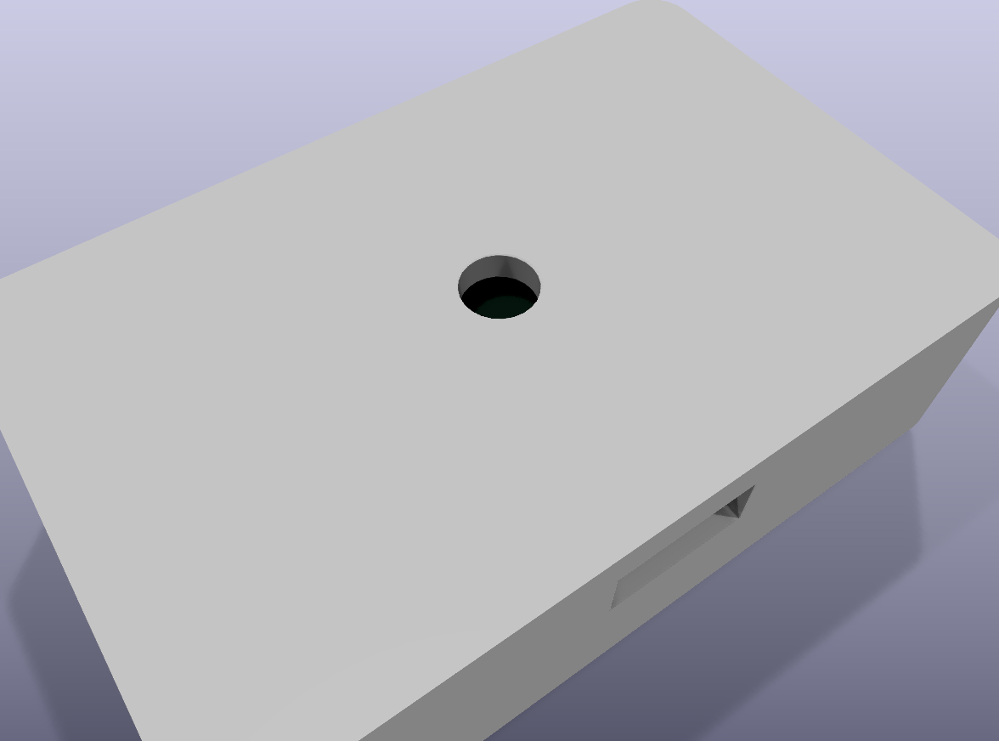
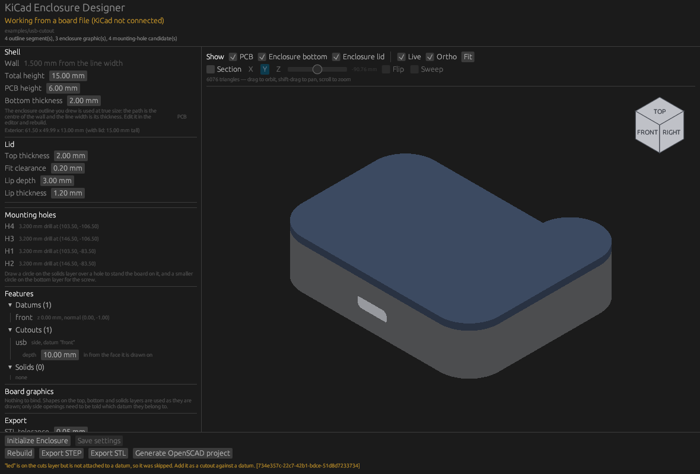
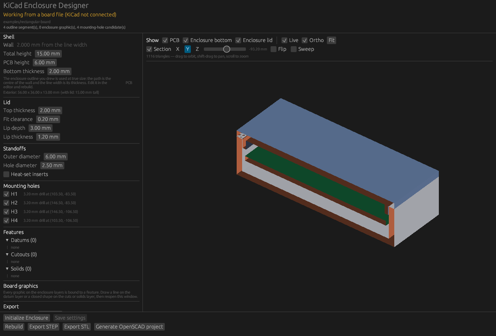
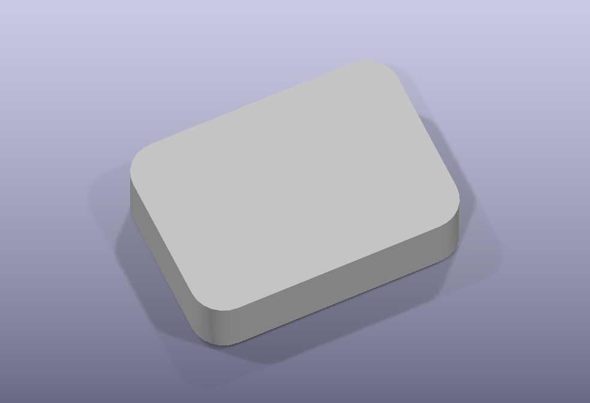
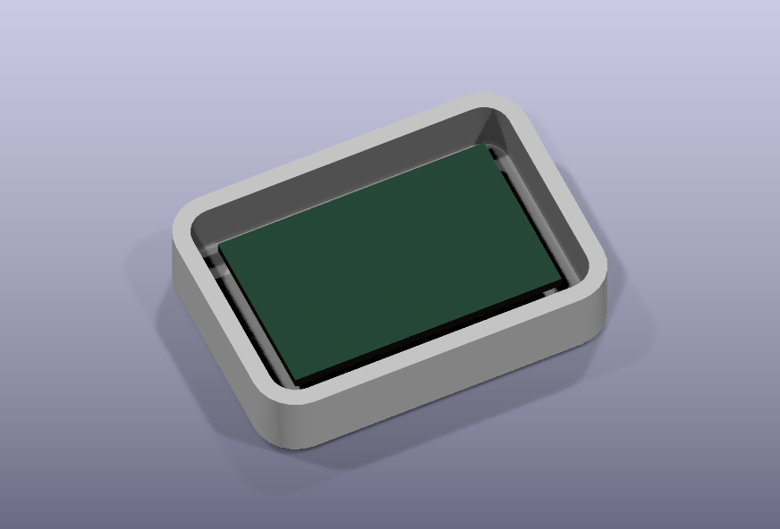

# KiCase

**Design a simple enclosure for your board without leaving KiCad.**

KiCase is a native KiCad 10 plugin that reads your PCB, interprets ordinary
KiCad drawings on a few user layers as enclosure features, and generates real
B-rep geometry — proper STEP, not a mesh — which shows up around your board in
KiCad's own 3D viewer.

You do not need FreeCAD, Fusion 360, SolidWorks or OpenSCAD. The PCB editor is
the sketching interface.

```text
KiCad PCB Editor
      |
      +-- Edge.Cuts            PCB shape
      +-- Enclosure            case outline (optional)
      +-- Enclosure.Cuts       holes, connector openings, vents
      +-- Enclosure.Datums     side-wall reference planes
      +-- Enclosure.Solids     ribs, bosses, extra material
      |
      v
  KiCase (Rust)  ->  B-rep  ->  STEP + STL  ->  KiCad 3D Viewer
```



*The `usb-cutout` example, rendered by KiCad itself: the board is visible
through the LED window, and the USB-C opening is cut into the front wall.*

KiCase is deliberately *not* a general-purpose CAD system. It is an electronics
enclosure generator built around KiCad PCB geometry.

## The viewport

KiCase draws its own 3D view, because KiCad's cannot do what enclosure work
needs: no live reload, no section plane, no per-part visibility, and no way to
colour the parts differently.



* **Orthographic by default** — no foreshortening, so edges that line up look
  like they line up. Perspective is a toggle away.
* **Show or hide each part** — board, bottom, lid.
* **Section plane** on X, Y or Z, dragged along a slider or swept
  automatically. Cut faces are called out in a contrasting colour so a section
  reads as material rather than a hole.
* **Live** — the board is watched on a background thread and the view follows as
  you edit, with no button to press. KiCad's API has no events, so this is
  polling: the board document is hashed every 250 ms and nothing happens until
  the hash moves.



Drag to orbit, shift-drag to pan, scroll to zoom. The geometry is the same
B-rep the STEP files come from, triangulated for display only.

## Supported versions

| | |
| --- | --- |
| KiCad | 10.0.1 and later (tested against 10.0.3) |
| Platforms | Linux, macOS, Windows |
| CAD kernel | truck, pure Rust — no C++ toolchain, nothing to install |

KiCad's IPC API needs the KiCad GUI to be running. Everything that only touches
geometry — rebuilding, exporting, validating — also works from a saved
`.kicad_pcb` with no KiCad running at all, via `--board`.

## Installing

1. Build the binary:

   ```sh
   cargo build --release
   ```

   The CAD kernel is pure Rust, so there is no C++ toolchain and nothing
   vendored to compile. A clean build is a few minutes on every platform.
   CMake and a C compiler are still needed for one small dependency: `nng`,
   the transport KiCad's IPC API speaks.

   The binary lands in `bin/release/kicase`.

2. Turn the API on in KiCad: **Preferences -> Plugins -> Enable IPC API**, then
   restart KiCad.

3. Install the plugin: copy `plugin/plugin.json` and `plugin/icons/` into a new
   folder inside KiCad's plugin directory, and put the `kicase` binary beside
   `plugin.json`.

   | Platform | Plugin directory | Manifest to copy |
   | --- | --- | --- |
   | Linux | `~/.local/share/kicad/10.0/plugins/kicase/` | `plugin/plugin.json` |
   | macOS | `~/Library/Preferences/kicad/10.0/plugins/kicase/` | `plugin/plugin.json` |
   | Windows | `%APPDATA%\kicad\10.0\plugins\kicase\` | `plugin/plugin.windows.json`, renamed to `plugin.json` |

   The Windows manifest is identical except that its entrypoint is
   `kicase.exe`; KiCad launches the file by name and will not find it
   otherwise.

   ```sh
   DEST=~/.local/share/kicad/10.0/plugins/kicase
   mkdir -p "$DEST"
   cp -r plugin/plugin.json plugin/icons "$DEST"/
   cp bin/release/kicase "$DEST"/
   ```

4. Restart KiCad. **Enclosure Designer** and **Rebuild Enclosure** appear in the
   PCB editor's plugin toolbar and under **Tools**.

### Windows

Windows is an ordinary `cargo build --release`, the same as anywhere else.

1. Install [Rust](https://rustup.rs/) (the default MSVC toolchain) and
   [CMake](https://cmake.org/download/) on `PATH`. Rust's MSVC toolchain brings
   in the Visual Studio Build Tools it needs; CMake is for `nng`.
2. Get the source onto a Windows path. Building from `\\wsl$\...` works but is
   slow; a local clone is better.
3. `cargo build --release`. A clean build is about three minutes — measured at
   2m42s on CMake 4.2 with no workarounds — and the binary lands in
   `bin\release\kicase.exe`.

4. Copy into place:

   ```bat
   set DEST=%APPDATA%\kicad\10.0\plugins\kicase
   mkdir "%DEST%"
   copy bin\release\kicase.exe "%DEST%\"
   copy plugin\plugin.windows.json "%DEST%\plugin.json"
   xcopy /E /I plugin\icons "%DEST%\icons"
   ```

5. Restart KiCad.

One thing to watch: a Windows KiCad can only talk to a Windows build of KiCase,
and a WSL KiCad only to a Linux build. They are separate installs with separate
plugin directories, and the IPC socket does not cross the boundary.

## The basic workflow

1. Open your board in the PCB editor.
2. Run **Enclosure Designer**, then press **Initialize Enclosure**. KiCase
   claims four free user layers, writes `.enclosure/enclosure.toml`, and puts an
   `ENCLOSURE_PREVIEW` footprint into a project-local library.
3. Place that footprint once: press **A** in the PCB editor, pick the **KiCase**
   library, and drop `ENCLOSURE_PREVIEW` anywhere on the board. This is what
   carries the 3D model; KiCad 10 has no working API for adding it
   automatically (see [docs/kicad-api-notes.md](docs/kicad-api-notes.md)).
4. Set wall, floor and clearances in the designer.
5. Press **Rebuild**. Open the 3D viewer (**Alt+3**) and your board is sitting
   inside an enclosure.
6. Draw a line on **Enclosure.Datums** along the wall you care about.
7. Draw a rectangle on **Enclosure.Cuts** next to that line, the size of your
   connector opening.
8. In the designer's *Board graphics* section, add the line as a datum and the
   rectangle as a cutout attached to it.
9. Press **Rebuild** again. The opening is now cut through that wall.
10. **Export STL** gives you printable `bottom.stl` and `lid.stl`.

Everything is saved in the project, so closing and reopening keeps your work.

## Layer semantics

KiCase claims four KiCad user layers and records which ones in
`enclosure.toml`. It never assumes `User.1`–`User.4` are free, and it never
takes a layer you are already drawing on.

| Layer | Meaning |
| --- | --- |
| `Enclosure` | Optional case outline, drawn at **true size**. The path is the centre line of the wall, the **width of the line** is the wall thickness, and any **arcs** are the corner radii. Otherwise the cavity is `Edge.Cuts` grown by the PCB clearance. |
| `Enclosure.Datums` | Straight lines. Each one can become a vertical reference plane for a side wall. |
| `Enclosure.Cuts` | Closed shapes that open a **side wall**. These are the only feature that needs anything said about it: which datum's wall it goes through. |
| `Enclosure.Top` | Closed shapes that hole the **lid**. |
| `Enclosure.Bottom` | Closed shapes that hole the **floor**. |
| `Enclosure.Solids` | Closed shapes that become **added material**. By default a shape rises from the cavity floor to the underside of the board — so a drawn circle is a standoff, with nothing configured. |

Shapes on the top, bottom and solids layers need no entry anywhere: the layer
is the instruction. A **standoff** is a circle on `Enclosure.Solids` with a
smaller circle on `Enclosure.Bottom` through it — post and screw hole, both
drawn.

A hole reaches in from the face it was drawn on: bottom holes cut upward, top
holes cut down. With no depth it goes through that part alone; give it a depth
long enough and it carries on through the other.

Nothing is encoded in line widths, colours, object names or reference
designators. The *only* link between a drawing and its meaning is the graphic's
persistent KiCad UUID, recorded in `enclosure.toml`. If you delete a graphic,
its entry becomes an **orphan**: KiCase tells you, and refuses to guess a
replacement.

## Draw the wall, don't configure it

If you draw a closed outline on the `Enclosure` layer, KiCase takes it
completely literally:

| What you draw | What it becomes |
| --- | --- |
| the path | the centre line of the wall |
| the width of the line | the wall thickness |
| the arcs in it | the corner radii |

So a 50 x 35 mm rounded rectangle stroked 2.5 mm wide gives a 52.5 x 37.5 mm
exterior with a 47.5 x 32.5 mm cavity — and the wall you see in the PCB editor
is the wall, at true size, over your actual board. Alignment is checkable in 2D
without opening the 3D viewer.

**There is no corner radius setting.** A straight box stays a straight box.
Corners are rounded only where the outline actually has arcs — drawn on the
`Enclosure` layer, or already present in `Edge.Cuts`. If you want a 5 mm corner,
draw a 5 mm arc.

The `wall` setting works the same way: it is a fallback, used only when nothing
is drawn on the `Enclosure` layer. When you do draw one, the designer shows the
wall as coming from your line width rather than silently ignoring the setting.



*The `drawn-outline` example: 2.5 mm wall and 5 mm corners, both taken straight
from the drawing.*

See the `drawn-outline` example.

## Datums

A datum is a line you draw on `Enclosure.Datums`. Its position and direction
define a vertical plane, and that plane gives you a local 2D sketch frame:

```text
Top view                          The datum plane, seen face on

    +----------------------+           V (world Z)
    |                      |           ^
    |      enclosure       |           |     +---------------+
    |                      |           |     | USB-C opening |
    +----------------------+           |     +---------------+
             |                         |
             |  datum "front"          +--------------------------> U
             v  (drawn as a line)     (0,0) = start of the datum line
       N (wall normal)                       at the datum's Z origin
```

* **U** runs along the datum line.
* **V** is world Z, straight up.
* **N** is the horizontal wall normal, perpendicular to both.

A shape drawn *beside* the datum line is folded up onto that plane: its distance
along the line becomes U, and its distance from the line becomes V (height). It
does not matter which side of the line you draw on — either way it maps upward,
which is what "the USB opening goes here, this far up the wall" means in
practice.

Each datum's Z origin is configurable:

| `z_origin` | Where V = 0 sits |
| --- | --- |
| `case_bottom` | Outside of the case floor |
| `pcb_bottom` | Underside of the PCB (enclosure Z zero) |
| `pcb_top` | Top copper surface of the PCB |
| `case_top` | Top rim of the bottom shell |
| `absolute` | Enclosure Z directly |

A `z_offset` shifts it further. So a connector that sits on top of the board is
usually `z_origin = "pcb_top"` with the opening drawn starting at its own height
above the datum line.

## Coordinate system

```text
X, Y   the KiCad PCB plane (Y is flipped once, at the KiCad boundary, so Z is up)
Z      perpendicular to the PCB
Z = 0  the bottom surface of the PCB
```

The vertical stack, with the defaults:

```text
   lid top        +6.6      lid thickness 2.0
   rim            +4.6      component clearance 3.0 above the board
   PCB top        +1.6      PCB thickness 1.6
   PCB bottom      0.0      <- Z = 0
   cavity floor   -4.0      standoff height 4.0
   case bottom    -6.0      floor thickness 2.0
```

## Generated files

```text
your-project/
  board.kicad_pcb
  .enclosure/
    enclosure.toml           <- your settings; commit this
    generated/
      enclosure.step         <- combined assembly, shown in KiCad's 3D viewer
      bottom.step
      lid.step
      bottom.stl
      lid.stl
    openscad/
      generated.scad         <- overwritten on every rebuild
      custom.scad            <- written once, never overwritten
```

Everything under `generated/` is disposable and reproducible: the same board
plus the same `enclosure.toml` always produces equivalent geometry. Nothing is
stashed in your home directory or the registry.

The 3D preview works through a locked, pad-less `ENCLOSURE_PREVIEW` footprint
that carries `enclosure.step`. It is excluded from the BOM and from position
files, and it is preserved (never duplicated) across rebuilds. KiCase reads back
where you placed it and writes `enclosure.step` relative to that position, so it
lines up wherever it sits. The per-part `bottom.step` and `lid.step` stay in
board coordinates, which is what a CAD or slicing tool wants.

`.enclosure/kicase.pretty/` holds the footprint library KiCase writes, and a
`KiCase` entry is added to the project's `fp-lib-table`. Existing entries in that
file are left alone.

### Hiding the lid to look inside

The bottom and the lid are attached to the preview footprint as **two separate
3D models**, so either can be hidden on its own:

1. Double-click the `ENCLOSURE_PREVIEW` footprint.
2. Go to the **3D Models** tab.
3. Untick `preview-lid.step`.



The setting lives in the board, so it survives rebuilds and reopening. Note that
KiCad's 3D viewer has no per-model checkbox of its own: its model-visibility
checkboxes work by footprint category (through hole / SMD / unspecified / DNP /
not in position files), not per model.

## OpenSCAD

OpenSCAD output is **optional and secondary**. It is not the geometry kernel:
STEP is the canonical artefact, and the OpenSCAD files are a hackable
approximation with curves flattened to line segments.

* `generated.scad` is regenerated on every rebuild. Do not edit it.
* `custom.scad` is created once and **never** overwritten. Put your own
  print-specific changes there.

Changes you make in `custom.scad` do **not** feed back into the STEP model or
into what KiCad shows. That is a one-way door, on purpose.

## Command line

The same binary works as an ordinary CLI. With no `--board` it talks to a
running KiCad; with `--board` it works from a saved file and needs no KiCad.

```sh
kicase --help
kicase init      --board board.kicad_pcb    # claim layers, write enclosure.toml
kicase list      --board board.kicad_pcb    # show enclosure graphics and their UUIDs
kicase add-datum --board board.kicad_pcb --id front --uuid <uuid> --z-origin pcb-top
kicase add-cutout --board board.kicad_pcb --id usb --uuid <uuid> --datum front --clearance 0.3
kicase rebuild   --board board.kicad_pcb --stl
kicase export    --board board.kicad_pcb --step
kicase validate  --board board.kicad_pcb
kicase designer                             # the egui window
```

## Examples

`examples/` holds four ready-made boards:

| Example | What it shows |
| --- | --- |
| `rectangular-board` | 50 x 30 mm board, four M3 holes, predictable 56 x 36 mm exterior |
| `rounded-board` | corners drawn as real `Edge.Cuts` arcs; the shell follows them |
| `usb-cutout` | a front datum plus a USB-C opening cut through the side wall |
| `nonrectangular-board` | an L-shaped board, to prove nothing assumes a rectangle |
| `drawn-outline` | the wall drawn at true size: line width is thickness, arcs are corner radii |

```sh
kicase init    --board examples/usb-cutout/usb-cutout.kicad_pcb
kicase rebuild --board examples/usb-cutout/usb-cutout.kicad_pcb --stl
```

## Architecture

```text
KiCad protobuf / board document
        |
   kicase-kicad      IPC session, board reader, layer allocation
        |
   kicase-geometry   Length, Point2/3, Arc2, Profile2d, the CadKernel trait
        |
   kicase-model      enclosure.toml, the semantic model, the build pipeline
        |
   kicase-truck      the CAD backend: the only crate naming a truck type
        |
   kicase-export     STEP, STL, OpenSCAD, the preview footprint
```

The rule that matters: **KiCad is the sketch editor, `enclosure.toml` stores
meaning, Rust owns the enclosure model, and the CAD kernel only creates
geometry.** Swapping B-rep kernels means rewriting one crate and nothing else.

That is not a claim, it is a thing that happened: KiCase was built on
OpenCascade and moved to truck without touching the KiCad integration, the
project format, datum behaviour or the UI. `kicase-occ` is still in the tree as
the reference the geometry tests check the pure-Rust backend against — the same
expectations run against both, and the two agree to 5e-5.

## Known limitations

* **KiCad must be running** for anything that touches the board. That is a
  KiCad 10 constraint, not a KiCase one. Use `--board` for geometry-only work.
* **The preview footprint must be placed once by hand.** KiCad 10.0.3's
  `ParseAndCreateItemsFromString` command accepts a request and creates nothing
  — verified against a live KiCad, including with KiCad's own serialisation of
  an existing footprint as the input. KiCase prepares the library and the
  `fp-lib-table` entry, and still tries the API first so it will start working
  by itself if a future KiCad implements the command.
* **KiCad's 3D viewer does not reload by itself.** `RefreshEditor` is not
  handled by the KiCad 10.0.3 PCB editor at all, so KiCase treats a refresh
  failure as normal. Close and reopen it if the model looks stale — or use
  KiCase's own viewport, which is what it is for.
* **Layer display names may need setting by hand.** KiCad 10's API has no
  command for renaming a user layer. KiCase enables and records the right
  layers, tries the stackup route, and tells you the exact names to set in
  **Board Setup -> Board Editor Layers** if that does not take.
* **Bezier curves (`gr_curve`) are ignored**, with a message. v0.1 handles lines
  and arcs.
* **One lid style**: a screw-on inset lid. Snap, slide and hinged lids are not
  implemented.
* **Side cutouts are `through` only.** Blind pockets are not implemented.
* **The board outline must be a single closed region.** Two disconnected
  outlines are reported as an error, naming the free end.

## KiCad API notes

[`docs/kicad-api-notes.md`](docs/kicad-api-notes.md) records what the KiCad 10
IPC API does and does not do, as measured against a running instance: which
commands work, which are unimplemented, where the Rust client's read model loses
information, and why board-file layer ids differ from API layer ids.

## Development

```sh
cargo fmt --all
cargo clippy --workspace --all-targets
cargo test --workspace
```

The geometry tests assert on measurable properties of the generated B-rep —
bounding box, volume, number of bodies — rather than on file bytes, because
STEP output carries unstable metadata.

## License

Licensed under either of [Apache License, Version 2.0](LICENSE-APACHE) or
[MIT license](LICENSE-MIT) at your option.
